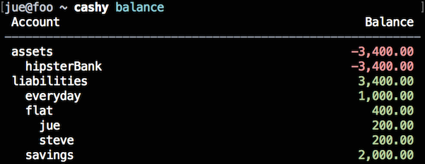

# Cashy

Cashy is a software designed for nerd compatible bookkeeping. Of course it offers an API for Node.js and a CLI tool with f*cking beautiful ANSI string color magic. With cashy you can split your bank account virtually into several sub accounts or combine bank accounts, cash boxes, money socks, ... to one logical account. The idea of writing such a tool arose from [Ledger](http://ledger-cli.org) - a wonderful piece of software but with a little show stopper: Immutable transactions are not enforced by design and must be implemented by convention. (*Don't remove lines from the database or a sweet kitten will die!*)

The main difference to ledger and (most?) of its clones is that chashy uses a SQLite database instead of just text files. Indeed, this is not very sexy but it is a good compromise between easy handling (e.g. you don't need a database server) and transaction based storing of data. That way it is not too easy edit transactions by hand; you always must use cashy to alter things, which enforces the user not to screw things up.

My use case: I'm using my bank account not just for myself but also as a shared account with my flat mate (let's call him Steve) for all expenses related to our flat. Thus, the available money on my bank account does not all belong to me (unfortunately!) but also to Steve. So I needed a tool to keep track of my balances and expenses. Furthermore, I can easily generate account statements for Steve filtering out all transactions not related to our flat stuff. So I don't have to be embarrassed if I buy things at ... well you know ... and pay them by transfer ;)


## Installation

``` shell
npm install -g cashy
```


## Concept

Cashy holds several accounts in a hierarchical structure. That way you can group financial transactions logically. Example: I split the flat account into two sub accounts: ```flat/jue``` and ```flat/steve```. So we can easily see who forgot to transfer the monthly contribution ;)

Transactions have to occur between at least two accounts. And they always must be balanced, i.e. the sum of all amounts must be zero. If you want to know the reason, drop "double-entry accounting" into your favourite search engine. As mentioned above, transactions are immutable once they have been committed. This ensures consistency and Steve can be sure that account statements are final and won't change in the future.


## Example

Back to my use case ... let's jump right in how I organised everything.

First of all, we need a new database. This command will create ```cashy.sqlite``` in the current directory:


Then add some accounts. I group them into ```assets```, where all the money can be found, and ```liabilities``` that tells us to whom the money belongs to.


Adding transactions to the database goes like this. They represent the following flows of money:

 * My employer transferred my salary.
 * Steve transferred his contribution to the flat account
 * I transferred the rent to our landlord.

If you look carefully at the "contribution Steve" transaction, you will see that the amount of "assets/hipsterBank" is missing. This amount will be calculated based on the fact that - as mentioned earlier - transactions always must be balanced.

The last command line commits all transactions. After this point they cannot be altered anymore.


Listing all transactions may help you to get a better overview what happened with the last commands.


Here you can see the balances of all accounts. It may seems confusing but at this point the balance of the account at hipster bank is actually positive. A negative value on asset accounts means you *own* money. A positive value says you *owe* money. This is due to the fact that transactions always must be positive. If you think this is confusing write a little wrapper inverting all amounts at assets accounts ;)



If you specify an account along with the ```list``` command you can list just transactions related to the stated account.


## Command Line Interface

Well ... I'm going to describe this later in detail. For now stick with the built-in help:

``` shell
cashy --help
cashy [command] --help
```

## API

Sry, missing too at this moment.
